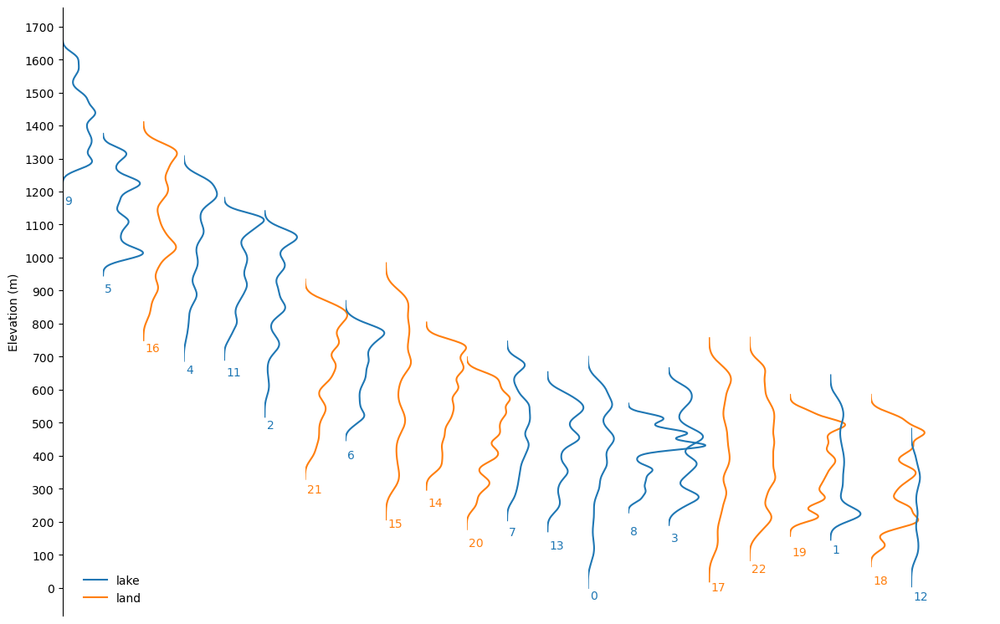
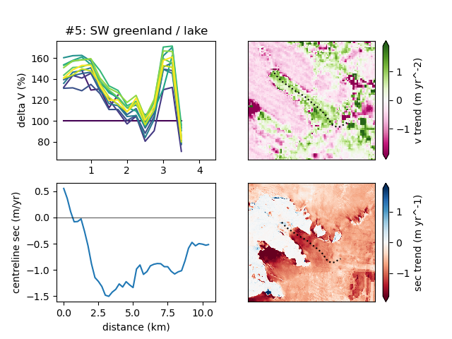
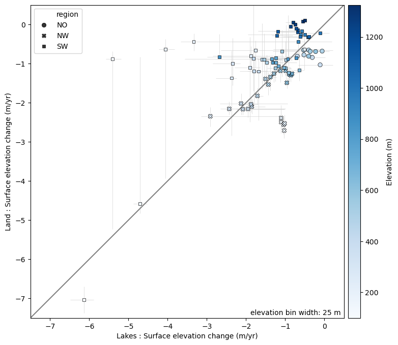
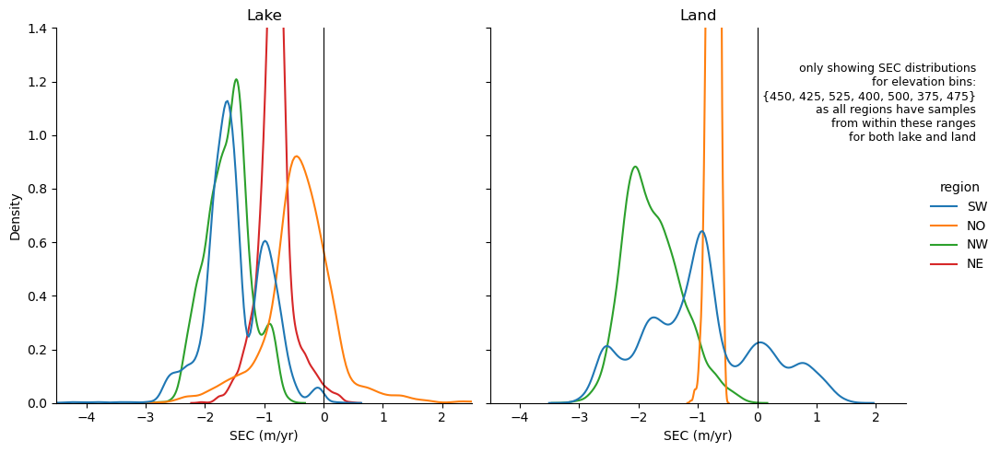
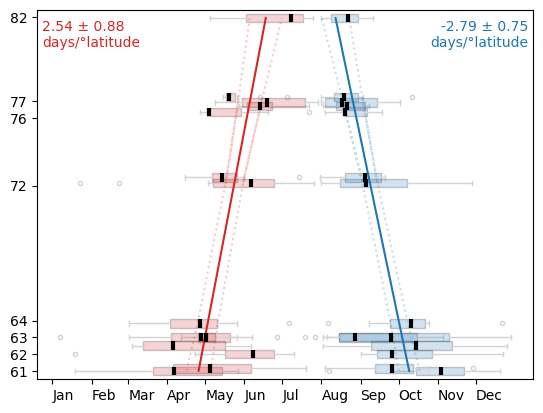

# paper 2

A key conclusion of [Holt et al., 2024](https://www.cambridge.org/core/journals/journal-of-glaciology/article/terminus-thinning-drives-recent-acceleration-of-a-greenlandic-laketerminating-outlet-glacier/762985B2AC938AB88E0C8CCEFE3042F2) is that profound changes in ice-dynamics at the lake-terminating glacier are driven by negative surface mass balance, which are in turn primarily driven by surface air temperatures.

To further illustrate (/test the hypothesis: surface air temperature --> thinning --> _then_ lake processes become important) that negative SMB, as a function of surface temperature is the key driver of processes at lake-terminating outlets (versus those pertaining to geometry/bed topography), the surface elevation change (SEC) and ice velocity analysis already conducted can be duplicated at study sites around Greenland (with a stretch goal of including Iceland), using latitude as a proxy for the magnitude of change in SMB over the last decade.

---

## code

### data sources
to download data required for analyses / visualisation
```bash
bash src/download_inputs.sh
```

### ice marginal lakes
how, p., et al., (2021) greenland-wide inventory of ice marginal lakes using a multi-method approach. *sci rep* **11**, 4481 https://doi.org/10.1038/s41598-021-83509-1

wiesmann, a., et al., (2021) esa glaciers climate change initiative (glaciers_cci): 2017 inventory of ice marginal lakes in greenland (IIML), v1. centre for environmental data analysis, 19 february 2021. doi https://dx.doi.org/10.5285/7ea7540135f441369716ef867d217519

to download:
```bash
wget -e robots=off --mirror --no-parent -r -P data/iiml/ https://dap.ceda.ac.uk/neodc/esacci/glaciers/data/IIML/Greenland/v1/2017//
```

### ice velocity
see [here](https://its-live.jpl.nasa.gov/#how-to-cite) for list of appropriate references

- ice velocity is taken from the latest version of itslive
- velocities derived using autoRift on pairs of landsat / sentinel acquisitions.
- data cubes of velocity are stored on aws and programmatically accessed using the [`itslive`](https://github.com/nasa-jpl/itslive-py/tree/main) python package


### arctic DEM
see [here](https://www.pgc.umn.edu/data/arcticdem/) for more detail

Porter, Claire, et al., 2022, "ArcticDEM - Strips, Version 4.1", https://doi.org/10.7910/DVN/C98DVS, Harvard Dataverse, V1, Accessed: 4th June 2024. 

catalog of ArcticDEM strips can be downloaded with:
```bash
wget --mirror --no-parent -r -P data/arcticDEM/ https://data.pgc.umn.edu/elev/dem/setsm/ArcticDEM/indexes/ArcticDEM_Strip_Index_latest_gpqt.zip
```

## study sites
Identifying study sites was a manual process, informed by high resolution satellite imagery and the Inventory of Ice Marginal Lakes (How et al., 2021)

centrelines for each study site are in `/data/streams_v3.geojson`**

**these were generated from a single point mid-glacier near the terminus and following the ice velocity field upstream (code is in the `Centreliner()` class).

### surface elevation change

```bash
bash src/elevation_workflow.sh
```
will run these scripts, in this order...
- `make_dirs.py`
    - usage: `python src/make_dirs.py --centrelines data/streams_v3.geojson`
    - makes a directory for in `data/` for each centreline in `data/streams_v3.geojson`
    - and puts copy of centreline (*singular*) in each directory
- `dem_download_tiles.py`
    - usage: `python dem_download_tiles.py --directory data/id#_Xx_Yy --months 4 5 6 7 8 9 10 --buffer 5000`
    - inputs: `--directory`, `--months`, `--buffer`
    - for given directory, downloads all arctic DEM strips that intersect with the the centreline in that directory
    - clips and pads each DEM to the bounds of the centreline + buffer (default=5000 m)
    - only includes DEMs captured during specified months
- `dem_get_masks.py`
    - usage: `python dem_get_masks.py --directory data/id#_Xx-Yy`
    - inputs: `--directory`
    - returns/outputs `.tif`
    - for given directory (`--directory`) take all DEMs with file name `padded_*` and get binary stable terrain mask (where 1==stable terrain; 0==snow/ice/water/unstable terrain) from landsat/sentinel
    - mask is re-projected to same extent & resolution as DEM
- `dem_coregister.py`
    - usage: `python dem_coregister.py --directory data/id#_Xx_Yy`
    - inputs: `--directory`
    - outputs: coregistered DEMs
    - for given directory containing several DEMs (all padded to same extent, with filenames `padded_*`) and their stable terrain masks (`masks_*`) auto-magically decide which DEM to use as the *reference* on the basis of number of valid pixels
    - coregister all DEMs to the reference, renaming to `coregd_*`
    - stable terrain mask used for coregistration is the logical AND of both `masks_*`, except when there are no overlapping valid pixels, in which case, revert to reference mask.
    - all meta-data from reference, and to_register DEM are added to the output `coregd_`
    - reference DEM is copied / renamed.
- `dem_stacking.py`
    - usage: `python src/dem_stacking.py --directory data/id1_6685x_-3188046y/`
    - inputs: `--directory`
    - outputs: `stacked_coregd.zarr` folder/file
    - for given directory containing multiple DEMs that have been coregistered (filename: `coregd_*`), read in and stack in time dimension.
    - retain *all* metadata and append to stack. export as .zarr
    - also export a `coregistration_metadata.parquet` containing the metadata
- `dem_trends.py`
    - usage: `python src/dem_trends.py --directory data/id#_Xx_Yy --nmad 2.5 --median 2`
    - inputs: `--directory`, `--nmad` (default 2.0), `--median` (default 1.0)
    - outputs `sec.zarr`
    - for given directory
        - open the stack of co-registered DEMs (`stacked_coregd.zarr`)
        - filter stack by `nmad_after` and `median_after` to only include DEMs whose values we 'trust' (where `nmad < 2` & `median < 1`)
        - down sample (by factor of 10 to 20x20 m using bilinear)
        - compute robust trends using `scipy.stats.theilslopes()`
        - export trends to `sec.zarr`
        - output has dimensions: `x`, `y` and `result`. where `result` has length four, and includes the slope estimate (`slope`) along with the 0.95 confidence intervals (`high_slope` and `low_slope`) as well as `intercept`
        - output has variables `sec` (dim: `y`, `x`, `result`) and `n` (dim: `y`, `x`) which counts the number of not null observations
- `dem_cleanup.py`
    - usage: `python src/dem_cleanup.py --directory data/id#_Xx_Yy/`
    - inputs: `--directory`
    - deletes all `.tif` files in directory

many of the above import `ArcticDEM` from `dem_utils.py` to access some helper functions.

### ice velocity

`velocoity_get_trends.sh` calls `velocity_robust_spatial_trends.py` for computing robust annual trends. Uses `velocity_utils.py` which classes for handling and processing its_live velocity data:
- `CentreLiner()`
- takes either point, or linestring input
- gets appropriate itslive velocity cube(s)
- crops it to fit buffer around centreline

it includes helper functions that...
- can filter along the time axis on `date_dt` or median absolute deviation (mad) of velocity values
- construct median annual composites
- generate flow line from a point
    - this was how the centrelines were originally constructed
- convenience plotting functions
- calculate robust trends using the [Theil-Sen estimator](https://en.wikipedia.org/wiki/Theil%E2%80%93Sen_estimator) as implemented in `scipy.stats.mstats.theilslopes`.

### lake ice
`lakeIce_incidentAngle.py` does some magic with DEMs and S1 meta data to normalize backscatter by incidence angle. Curiously, and despite a variety of incidence angles the relationship between backscatter and incidence angle in these data was so weak, that I don't feel any correction is needed.

`lakeIce_utils.py` houses some helper functions


### `imagery.py`
contains following functions
- `get_annual_median_mosaic()`
    - takes points from [potential_study_sites_v1](data/potential_study_sites_v1.geojson) 
    - gets all collection-2 level 2 landsat for july-sept (inc) with eo:cloud_cover < 20 %
    - apply bit mask for cirrus, cloud, cloud shadow
    - group by year and get median
- `animate_rgb()`
    - animate annual medians and save .gif [here](results/intermediate/study_site_animations/)

---

the `.ipynb` files are a bit messy, but hopefully explain themseleves. They were mostly used for plotting, and developing the above scripts.


# results & figures

Study site hypsometries. Because not all study sites are at the same elevation, it is necessary to normalize by elevation later on.


In [this directory](results/figures) there are lots of these:

Summary plots showing (top left) change in velocity as along centreline as a % relative to 2013; (top right) velocity trend; (lower left) rate of surface elevation change along centreline; (lower right) surface elevation change field. Upper and lower right cover same extent, and shown at same scale.

Comparing rates of SEC between lake- and land-terminating outlets, grouping by elevation. Points are shown are the median SEC within the elvation band, and the error bars span the interquartile range. Points in the upper left show where lakes are thinning at a faster rate than land.


And the same data, but showing the distributions more explicitly:



Using the largest change in median backscatter across the lakes between successive S1 acquisitons to _estiimate_ timing of freeze up and thaw.  Cut-off date of 31st July (i.e. thaw happens before then, and freeze happens after). Despite being shown on the y-axis here (for a more intuitive view (North-up with time moving left-to-right), latitude is very much the independent variable here).
