# ice surface velocity

## method
### input data
a point near the terminus
- point is buffered by 8-10 km and the ITS_LIVE velocity cubes that intersect this area identified

### cube processing
- cubes clipped to area and filtered:
    - 335 days <= `date_dt` < 395 days
        - this selects for velocity fields that approximate average annual velocity
    -  the v_x and v_y components are filtered independently of one another
    -  values that are +/- 5 * MAD are removed
    -  this filtering is _similar_ to that used by [nanni et al., 2023](https://doi.org/10.5194/tc-17-1567-2023)
  
### centreline creation
- the v_x and v_y component fields from the most recent complete year (2022) are used to generate the (centre) flowline that extends up/down from input point.
- these flowlines are exported and manually tidied.

### sampling
- the filtered velocity cubes are sampled at 100 points evenly distributed along the length of the flowline
- these samples are grouped by the year of their `mid_date` (the mid-date of the two images used to generate the velocity field) and the median and (normalized) median absolute deviation calculated.

### still to do (/would like to do):
- timeseries of velocities near the terminus with `date_dt` <= 30 days ish (for seeing seasonal variability)
- look at timing of any speed up / slow downs
- look at latitude & east/west as potential
- bed / surface topo
- something that looks a bit like [ashmore et al., 2022](https://doi.org/10.5194/tc-16-219-2022) for modes of variability

## results
### outlet #0

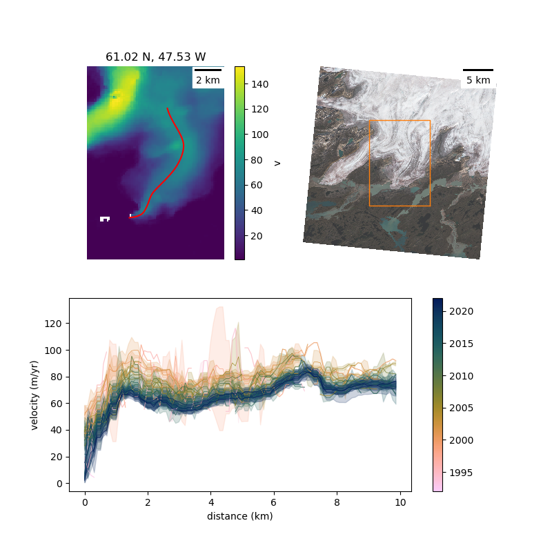

- slow flowing
- behaving like a land-terminating outlet
- velocity decreases toward the terminus
    - suggesting lake has minimal influence
- has slowed over the last 20 years

### outlet #1

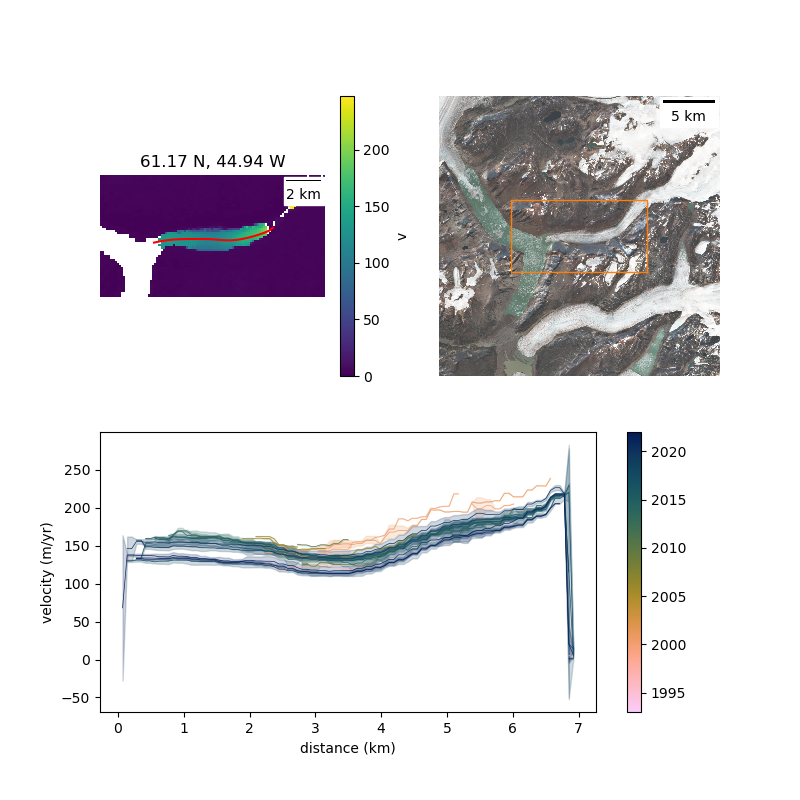

- moderate speed, with a very slight uptick in velocity towards the terminus
- lake likely has *some* influence
- has slowed in recent years

### outlet #2

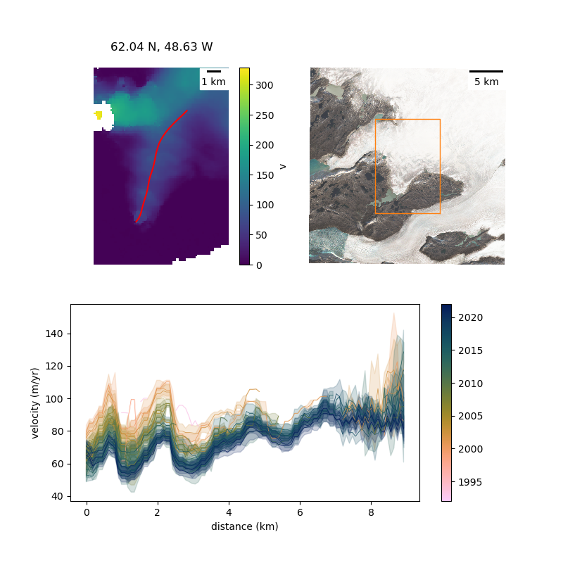

- slowed in recent years
- curious velocity profile
    - check bed topo here
- lake _might_ have some influence here

### outlet #3

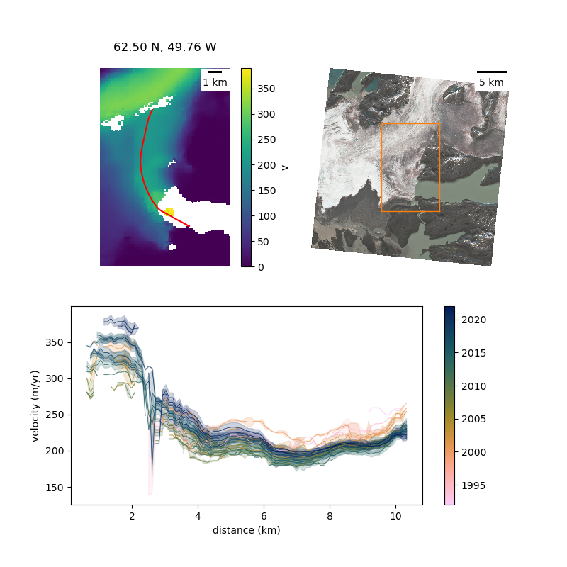

- this outlet is part ice-sheet fed, part ice-cap fed
- despite the reasonably sharp curve, maintains high (ish) velocity
- lake is clearly doing something
- has accelerated in recent years
- upglacier (6-10 km) however, it is presently flowing slower than pre-2000

### outlet #4

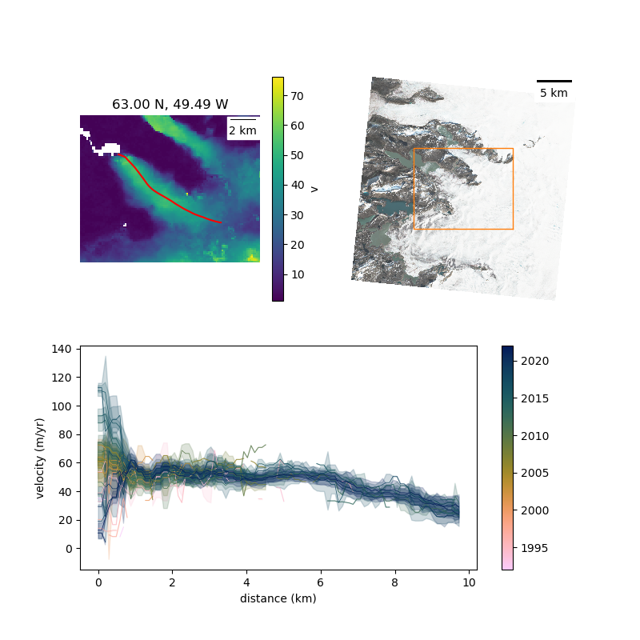

- slow flowing oulet
- velocity used to increase toward the terminus ~2015
- now velocity profile more akin to land-terminating

### outlet #5

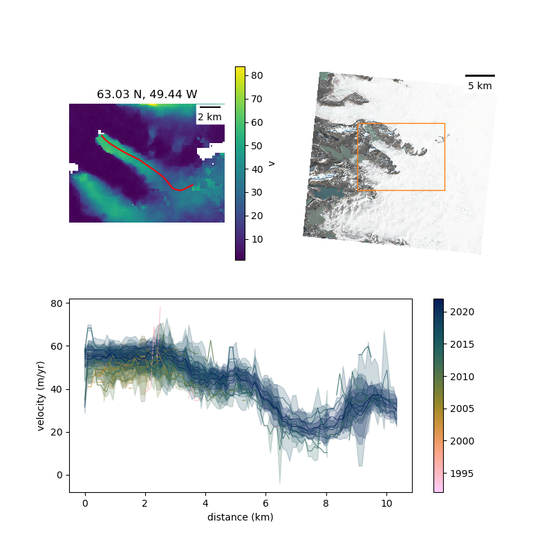

- slow flowing
- slight uptick in velocity toward terminus
- very modest acceleration in recent years

### outlet #6

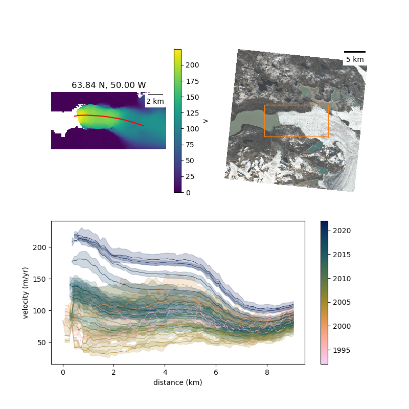

- we know all about this one

### outlet #7

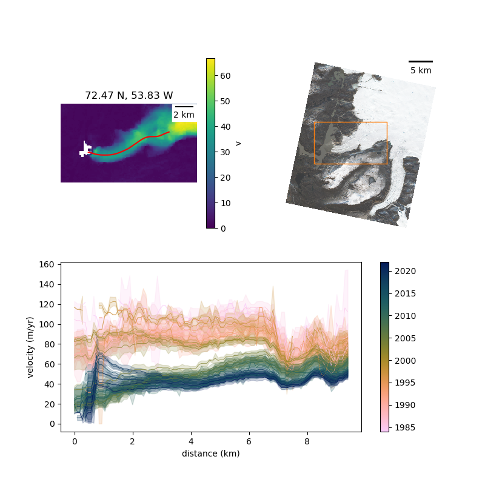

- interesting
- has slowed down since the 1990s
    - but the profile does show a tick up in velocity toward the terminus since ~2018
    - and has accelerated since early 2010s
    - NOTE: end of centreline might not be bang on the terminus - hence the drop off at ~0.5 km

### outlet #8

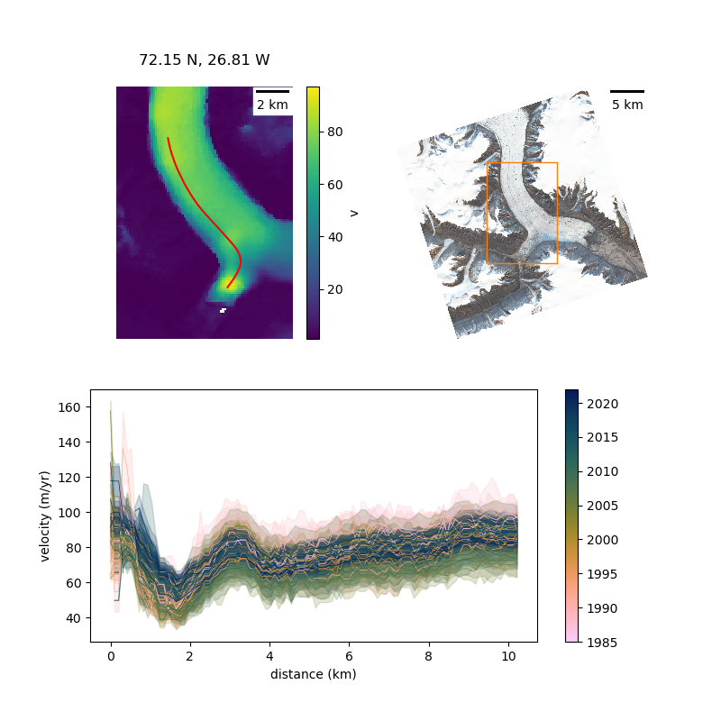

- little distributary, which (surprisingly) does have an area near the terminus of elevated surface velocity
    - which have increased since the 2000s
    - but aren't greater than those measured in the 1990s

### outlet #11

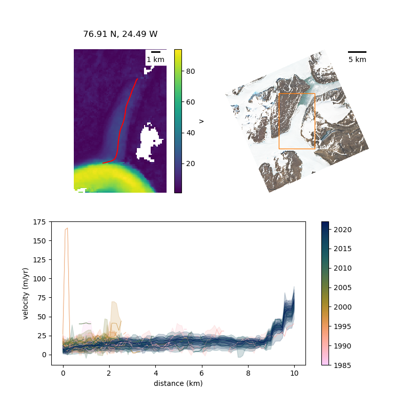

- useless

### outlet #12

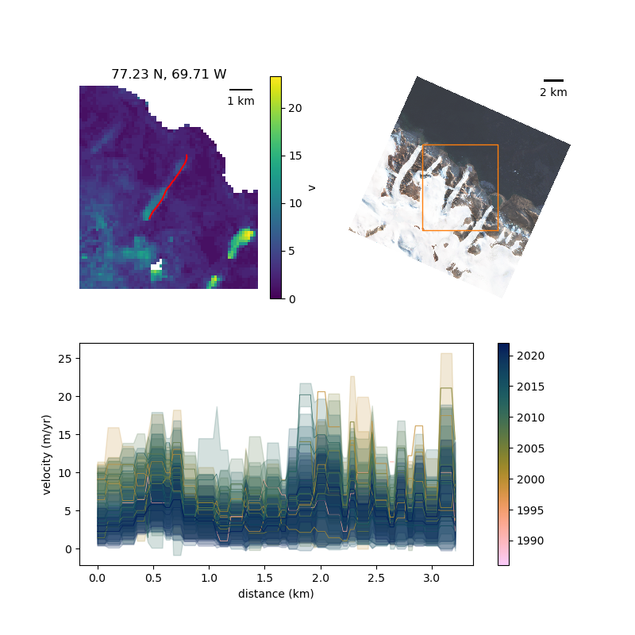

- even more useless
